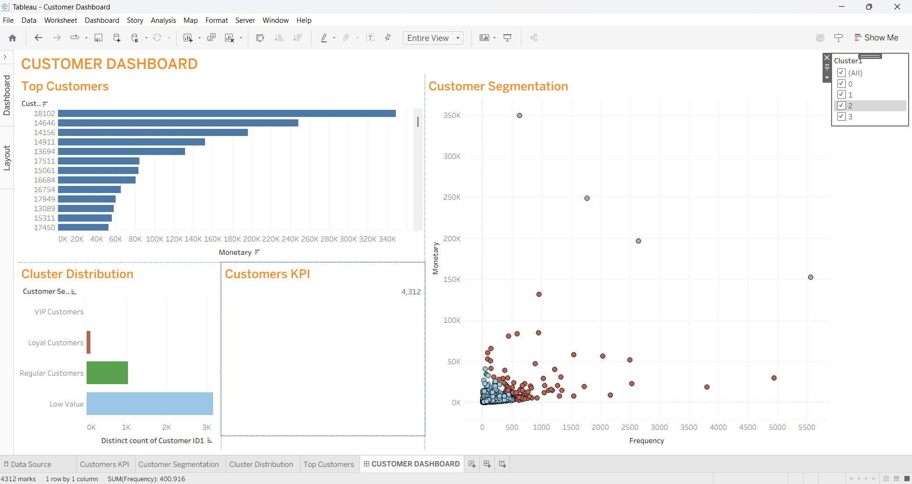
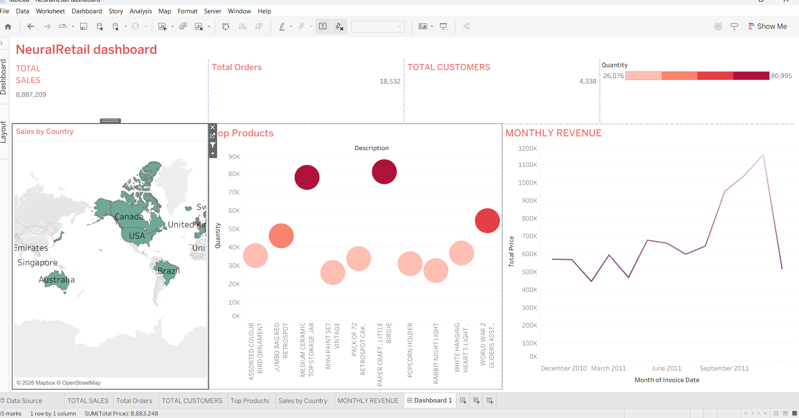
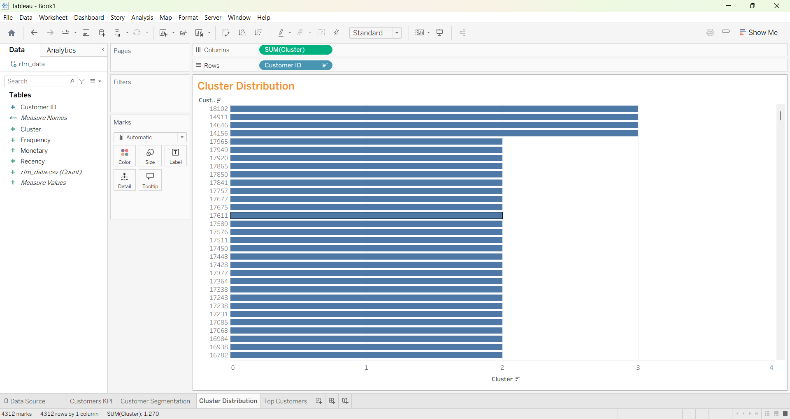
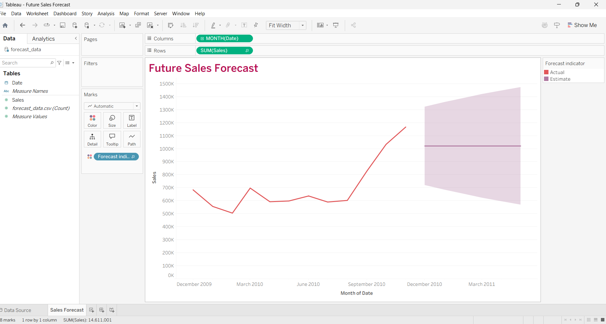

dir# 🛍️ NeuralRetail Customer Segmentation & Sales Analytics

## 📌 Project Overview

NeuralRetail is a retail analytics project focused on understanding customer purchasing behavior, sales performance, and future revenue forecasting.

The project combines:

- Data Cleaning & Preprocessing
- Exploratory Data Analysis (EDA)
- RFM Analysis
- Customer Segmentation
- K-Means Clustering
- Sales Forecasting
- Interactive Tableau Dashboards

---

## 🎯 Business Problem

Retail businesses often struggle to:

- Identify their most valuable customers
- Predict future sales
- Understand customer purchasing patterns
- Improve retention strategies

This project addresses these challenges through data-driven customer segmentation and forecasting.

---

## 🛠️ Tech Stack

### Programming

- Python
- SQL

### Libraries

- Pandas
- NumPy
- Matplotlib
- Scikit-Learn
- Seaborn

### Visualization

- Tableau Public

### Analysis Techniques

- RFM Analysis
- K-Means Clustering
- Sales Forecasting

---

## 📂 Project Structure

```text
NeuralRetail_Project_Final
│
├── data/
├── notebooks/
├── dashboard/
├── reports/
├── screenshots/
└── README.md
```

---

## 📊 Key Features

### Customer Segmentation

Customers are segmented into groups using:

- Recency
- Frequency
- Monetary Value

### RFM Analysis

Measures:

- How recently customers purchased
- How frequently they purchase
- How much revenue they generate

### K-Means Clustering

Used to identify customer groups such as:

- High Value Customers
- Loyal Customers
- At-Risk Customers
- Low Engagement Customers

### Sales Forecasting

Predicts future revenue trends using historical transaction data.

---

## 📈 Dashboard Screenshots

### Customer Dashboard



### Sales Dashboard



### Cluster Distribution



### Forecast Dashboard



---

## 📌 Key Insights

- Identified high-value customer segments.
- Improved customer understanding using RFM scoring.
- Built customer clusters for targeted marketing.
- Forecasted future sales trends.
- Created interactive Tableau dashboards for decision making.

---

## 🚀 How to Run

### Clone Repository

```bash
git clone https://github.com/yourusername/NeuralRetail-Customer-Segmentation-Analytics.git
```

### Install Requirements

```bash
pip install -r requirements.txt
```

### Run Jupyter Notebook

```bash
jupyter notebook
```

Open notebooks folder and run:

- NeuralRetail_Project1.ipynb
- NEURALRETAIL_PROJECT2.ipynb

---

## 📄 Report

Detailed project report available in:

```text
reports/NeuralRetail_Report.pdf
```

---

## 👨‍💻 Author

Om Pandey

B.Tech CSE | Data Analytics Enthusiast

### Skills

- Python
- SQL
- Tableau
- Machine Learning
- Data Visualization
- Business Analytics

---

## ⭐ Project Outcomes

✔ Customer Segmentation

✔ RFM Analysis

✔ K-Means Clustering

✔ Sales Forecasting

✔ Tableau Dashboards

✔ Business Insights